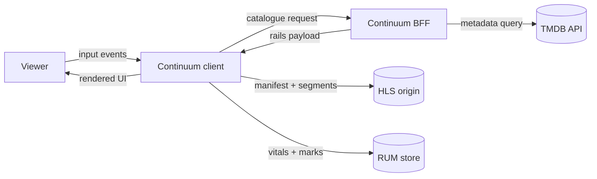
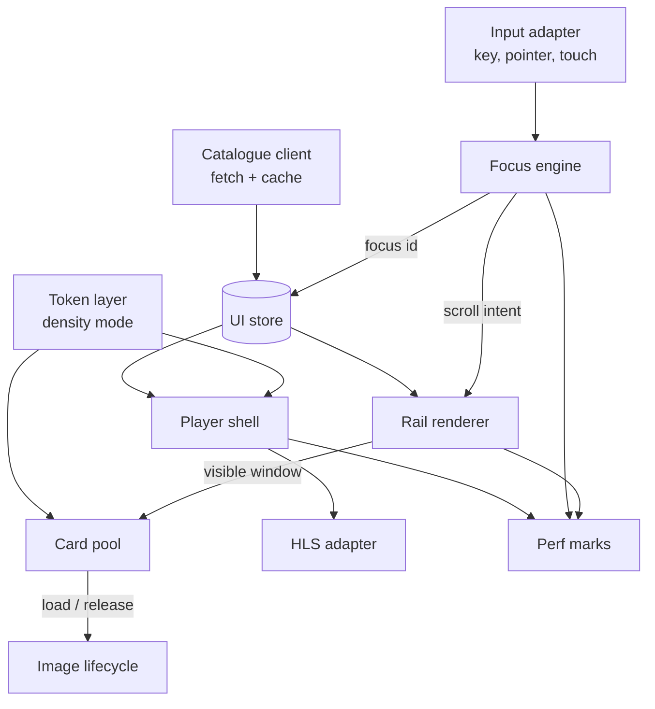
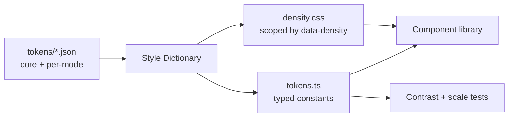
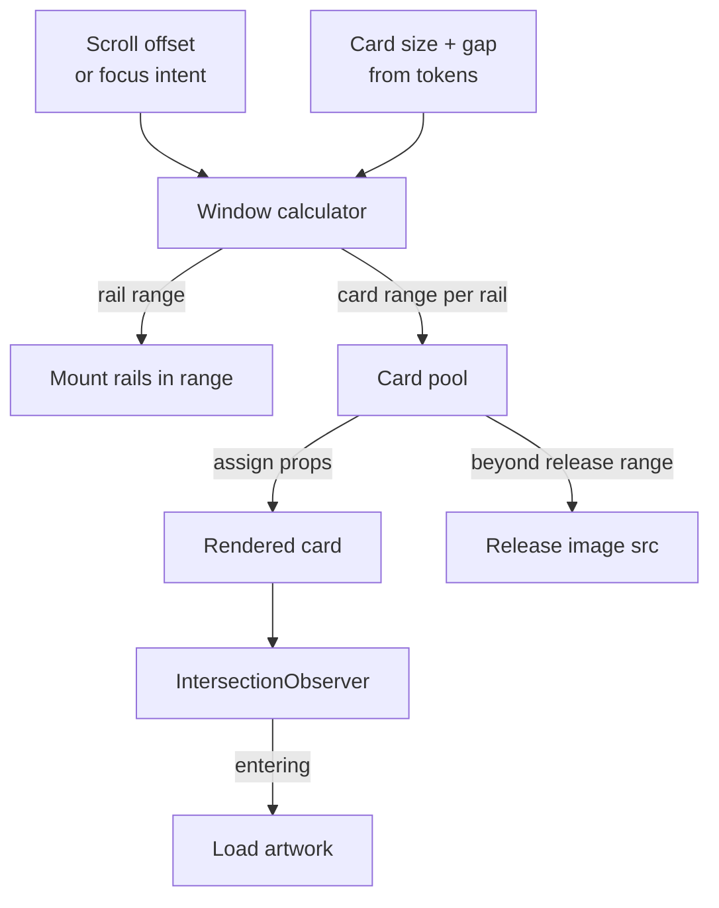
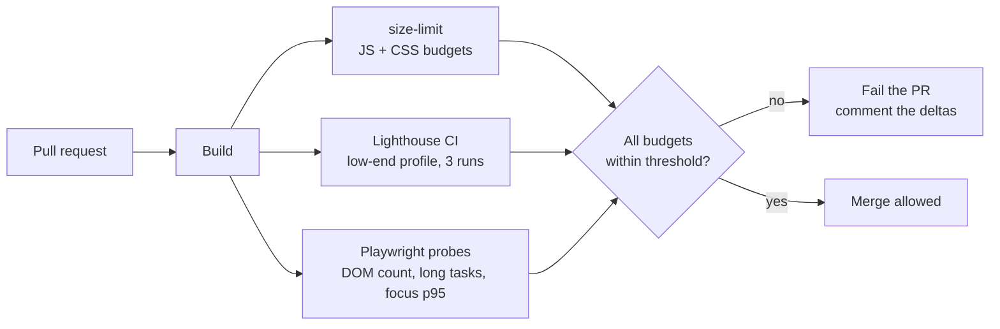
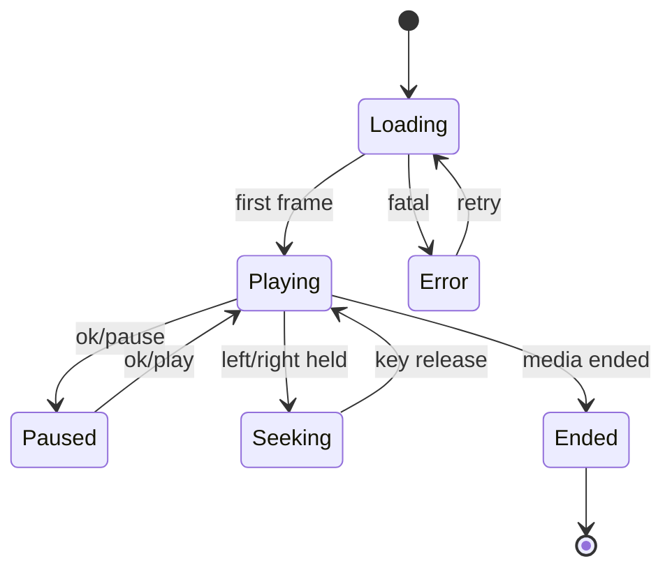

# Continuum — Cross-Surface Streaming UI

## Business & Technical Requirements Document

2026-09-22 · @Someone

## Why this project

**Continuum** is one React codebase that renders the same streaming catalogue at phone distance and at TV distance, held to a performance budget that fails the build when it regresses. It is chosen specifically because its four hardest parts are the four rows where your resume scored lowest against the JioHotstar JD.

The thesis in one line: *a single design system, focus engine and rail renderer that adapt to viewing distance and input device, instead of a forked codebase per surface.*

| Weak row in the JD scoring | Score now | What closes it in Continuum |
| --- | --- | --- |
| Deep knowledge of how browsers work | 5/10 | Layout-thrash avoidance in the focus engine, compositor-only rail transforms, decoded-image memory release |
| High performance | 2/10 | Budgets enforced in CI on a 6x-throttled profile; DOM node ceiling; long-task instrumentation |
| Cross-browser compatibility | 2/10 | Playwright across Chromium, Firefox and WebKit; legacy build targeting Tizen and webOS Chromium versions |
| Documentation, DFDs, code comments | 1/10 | This document, six ADRs, and Level 0/1 DFDs committed to the repo |
| OTT / streaming / TV domain | 0/10 | The entire project |

Two secondary gains. The spatial navigation engine is genuinely reusable, so publishing it as an MIT-licensed npm package converts the JD's "open source contribution is good to have" from absent into real. And building in TypeScript makes that keyword honest rather than a claim you would have to defend cold in a screen.

This also extends what you can already defend. QuizArena's token layer is the seed of Pillar A — you are not starting a new competence, you are taking an existing one somewhere harder.

---

# Part 1 — Business Requirements Document

## 1. Executive summary and problem statement

A streaming platform ships the same catalogue to three surfaces that share nothing but the content: a touch phone browser at 40cm, a mouse-and-keyboard desktop at 60cm, and a D-pad smart TV at 3 metres. The industry default is to fork the frontend per surface. Continuum proposes one codebase with a density dimension in its token layer and a headless input abstraction, so a component is written once and rendered correctly on all three.

### The business problem, in three parts

**Forking costs three times.** When web and TV are separate codebases, every feature is built three times, every bug is fixed three times, and the design system drifts until the surfaces no longer look like the same product. For an org like JioStar's Viewer Experience group — which owns Search, Personalization, Watch Experience and Interactivity across all surfaces — that multiplier applies to the whole roadmap, not one feature.

**The TV hardware is a decade behind the phone.** Entry-level smart TVs ship 1–2 GB of shared RAM, a CPU roughly 6–10x slower than a mid-range phone, and a browser engine frozen at the firmware version. A catalogue home page of 20 rails × 40 items is around 800 cards and 10,000+ DOM nodes if rendered naively. On that hardware it means a multi-second time-to-interactive, visible scroll jank, and on the worst devices a renderer crash from decoded-image memory.

**The remote control is not a mouse.** D-pad navigation has no pointer and no meaningful tab order. The browser gives you DOM-order focus; the user expects geometric focus — pressing Right moves to the thing visually to the right, and returning to a rail restores the card they left. Every TV team builds this, and a naive implementation is also the single largest source of input latency on the platform.

### Why it matters at this scale

The JioStar posting states a reach of more than 750 million viewers weekly across its network and streaming service. At that scale the distribution of devices matters more than the median: a 200ms regression in focus response is invisible on a developer's MacBook and disqualifying on a three-year-old Tizen TV, and the second group is not a rounding error in India.

> **Scope note on numbers.** The 750M figure is quoted from the job posting itself. Every other figure in this document is a *design target* for your build, not a measured JioHotstar internal metric. Do not present them as company data.

## 2. Objectives, KPIs and personas

Every objective below has a number attached, because a bullet without a measured number is the thing your master resume already tells you never to ship.

### Business objectives

| ID | Objective | Why it matters |
| --- | --- | --- |
| BO-1 | One component library serves web and TV | Removes the 3x build-and-fix multiplier and stops design-system drift |
| BO-2 | Catalogue is usable on 1 GB / 6x-throttled hardware | Protects the largest and least-served segment of the audience |
| BO-3 | Focus response feels instant on a D-pad | Input latency is the dominant perceived-quality signal on TV |
| BO-4 | Performance cannot silently regress | Converts operational excellence from intention into a build gate |
| BO-5 | The system is documented well enough to hand over | DFDs and ADRs are an explicit JD responsibility |

### Key results — the numbers to hit and measure

| ID | Metric | Target | Measured with |
| --- | --- | --- | --- |
| KR-1 | Largest Contentful Paint, low-end profile | ≤ 2.5 s | Lighthouse CI, 6x CPU throttle, 1.6 Mbps |
| KR-2 | Total Blocking Time, low-end profile | ≤ 200 ms | Lighthouse CI |
| KR-3 | DOM nodes on catalogue home, steady state | ≤ 1,500 | `document.querySelectorAll('*').length` in a Playwright probe |
| KR-4 | JS heap after 5 minutes of continuous browsing | No upward trend across 3 samples | Chrome DevTools Protocol heap snapshots |
| KR-5 | D-pad focus response, key press to paint | ≤ 100 ms at p95 | User Timing marks + PerformanceObserver |
| KR-6 | Sustained frame rate during rail scroll | ≥ 55 fps desktop, ≥ 28 fps throttled | `requestAnimationFrame` sampling |
| KR-7 | Initial JS bundle, gzipped, per entry | ≤ 180 KB | `rollup-plugin-visualizer` + a CI size check |
| KR-8 | Time to first video frame | ≤ 2 s on broadband | `hls.js` events + User Timing |
| KR-9 | Component reuse across surfaces | ≥ 90% of components shared, 0 forked | Import graph audit |
| KR-10 | Cross-engine E2E suite | Passes on Chromium, Firefox, WebKit | Playwright CI matrix |

KR-3, KR-5 and KR-7 are the three that become resume bullets. Record the before-and-after for each, because the delta is the bullet, not the final value.

### Personas

| Persona | Device and context | What breaks for them today |
| --- | --- | --- |
| Living-room viewer | 2021 entry-level Tizen TV, 1 GB RAM, 3 m viewing distance, D-pad only | Slow home page, laggy focus, text too small to read from the sofa |
| Commuter | Mid-range Android phone, 4G that drops to 3G, touch | Heavy bundle, images that never finish, layout shift |
| Desktop browser | Laptop, mouse and keyboard, second screen while working | Fine today — this is the surface everyone optimises for |
| Frontend engineer (internal) | Ships a feature that must land on all three | Writes it three times, and the three drift apart |

The fourth persona is the one that justifies the architecture. The first three justify the performance work.

## 3. Scope

The exclusions matter more than the inclusions. Each one is something you cannot build honestly as a solo project, and claiming it would hand an interviewer an easy way to catch you out.

### In scope

- Catalogue browsing: home page of composed rails, title detail page, genre and search results
- Cross-surface design system: tokens, density modes, component library, Storybook
- Spatial navigation engine for D-pad, with mouse and touch as peer input modes
- Two-dimensional virtualized rail rendering with card recycling and image lifecycle management
- Player shell over HLS: transport controls, D-pad seeking, resume position, subtitle track selection, next-episode autoplay
- A Backend-for-Frontend that composes rails and serves a stable catalogue contract
- Performance budgets enforced in CI, plus a real-user-monitoring endpoint and dashboard
- Cross-engine E2E suite and a legacy build target for TV browser engines
- Documentation: this BRD/TRD, Level 0 and Level 1 DFDs, six ADRs, JSDoc on public module surfaces

### Out of scope, and why

| Excluded | Why you cannot claim it |
| --- | --- |
| DRM (Widevine, PlayReady, FairPlay) | Requires a licence server and studio agreements. No student project has these. Use clear HLS test streams. |
| Real recommendation ML | Rail ordering is rules-based over metadata. Calling a hand-written heuristic "personalization" is the kind of claim that collapses in an interview. |
| Native TV packaging (Tizen `.wgt`, webOS `.ipk`) | Optional stretch. The web app runs in the TV browser; packaging and store submission adds process, not engineering signal. |
| Authentication, entitlements, billing | Solved problems that consume weeks and prove nothing a recruiter is looking for here. Stub the user. |
| Live sports, low-latency streaming | A genuinely different problem domain. Do not gesture at it. |
| Server-side rendering | Deliberately excluded — see ADR-6. TV browsers make SSR hydration costs worse, not better. |
| Real production traffic | Your RUM dashboard shows your own sessions and synthetic runs. Never imply user numbers you do not have. |

### The honesty rule for this project

Every number that reaches your resume must come from a run you can reproduce on demand. If an interviewer says "show me", you should be able to open the repo, run one command, and point at the output. Anything you cannot reproduce that way does not go on the page.

## 4. Functional requirements

Priority: **M** must-have for the minimum shippable cut, **S** should-have, **C** could-have if time allows.

### Catalogue and discovery

| ID | Requirement | Priority |
| --- | --- | --- |
| FR-01 | Home page renders an ordered set of rails, each with a title and a horizontally scrolling list of cards | M |
| FR-02 | Rail composition is driven by the BFF response, not hardcoded in the client | M |
| FR-03 | A card shows artwork, title, and up to two metadata badges, sized per density mode | M |
| FR-04 | Selecting a card opens a title detail page with synopsis, cast, duration, and a play action | M |
| FR-05 | A "Continue watching" rail appears first when at least one resume position exists | S |
| FR-06 | Genre browse renders a paginated grid using the same virtualization primitives as rails | S |
| FR-07 | Search returns results as the user types, debounced, with an explicit empty state | S |
| FR-08 | Search on TV uses an on-screen keyboard navigable by D-pad | C |

### Navigation and input

| ID | Requirement | Priority |
| --- | --- | --- |
| FR-09 | Arrow keys and D-pad move focus to the nearest focusable in that direction, by geometry not DOM order | M |
| FR-10 | Enter activates the focused element; Back and the TV-specific back keycodes pop navigation | M |
| FR-11 | Each rail remembers the last focused card; returning to it restores that card, not the first | M |
| FR-12 | Focus movement scrolls the rail so the focused card stays within the safe area, never partially clipped | M |
| FR-13 | Held-down direction keys repeat smoothly without dropping frames or overshooting | M |
| FR-14 | Modals trap focus; Back closes them and restores focus to the invoking element | S |
| FR-15 | Mouse hover and touch set focus through the same engine, so all three inputs share one focus model | S |

### Playback

| ID | Requirement | Priority |
| --- | --- | --- |
| FR-16 | Player plays an HLS stream with adaptive bitrate, with a native-HLS path on Safari | M |
| FR-17 | Transport controls support play, pause, and ±10s seek via D-pad, with an auto-hiding control bar | M |
| FR-18 | Playback position is persisted and offered as resume on the next visit | M |
| FR-19 | A seek preview scrubber shows the target timestamp while holding a direction key | S |
| FR-20 | Subtitle and audio tracks can be listed and switched | S |
| FR-21 | Next-episode autoplay with a cancellable countdown | C |

### Cross-surface behaviour

| ID | Requirement | Priority |
| --- | --- | --- |
| FR-22 | Density mode is detected at boot from viewport, pointer capability and user-agent, and overridable by query parameter for testing | M |
| FR-23 | Every component renders correctly in all three density modes with no per-surface forks | M |
| FR-24 | TV mode respects a configurable title-safe inset on all four edges | M |
| FR-25 | Light and dark themes are a token swap, with no component-level overrides | S |

FR-22's query-parameter override is not a convenience. It is what makes FR-23 testable in CI — Playwright can load the same page in `?density=tv` and assert against it without a TV.

## 5. Non-functional requirements

### Performance budgets

These are build gates, not aspirations. A pull request that breaches one fails CI.

| ID | Budget | Threshold | Enforced by |
| --- | --- | --- | --- |
| NFR-01 | Initial JS, gzipped, per entry point | ≤ 180 KB | `size-limit` in CI |
| NFR-02 | CSS, gzipped | ≤ 40 KB | `size-limit` |
| NFR-03 | LCP on low-end profile | ≤ 2.5 s | Lighthouse CI assertion |
| NFR-04 | TBT on low-end profile | ≤ 200 ms | Lighthouse CI assertion |
| NFR-05 | CLS | ≤ 0.05 | Lighthouse CI; fixed card dimensions make this achievable |
| NFR-06 | DOM nodes, catalogue home, steady state | ≤ 1,500 | Playwright assertion |
| NFR-07 | Long tasks over 50 ms during rail scroll | 0 on desktop, ≤ 2 throttled | PerformanceObserver in an E2E probe |
| NFR-08 | Focus response p95 | ≤ 100 ms | User Timing marks collected in E2E |
| NFR-09 | Heap growth over a 5-minute browse | < 10% across 3 samples | CDP heap snapshots |

The low-end profile is fixed and committed: **6x CPU throttle, 1.6 Mbps down / 750 Kbps up, 150 ms RTT, 1280×720 viewport.** Nail this file down early; a budget measured against a moving profile means nothing.

### Accessibility

| ID | Requirement |
| --- | --- |
| NFR-10 | Text and interactive elements meet WCAG 2.1 AA contrast in both themes and all density modes |
| NFR-11 | Every focusable element has a visible focus indicator that meets the 3:1 non-text contrast minimum |
| NFR-12 | The app is fully operable by keyboard alone, which on this project is the same code path as the D-pad |
| NFR-13 | Rails expose correct roles and labels; card counts are announced to assistive technology |
| NFR-14 | Player controls have accessible names, and captions can be enabled independently of audio |
| NFR-15 | `prefers-reduced-motion` disables rail scroll animation and the control-bar fade |

NFR-12 is the quiet win. Because TV navigation *is* keyboard navigation, the accessibility work and the TV work are the same work — which is a genuinely good answer to "how do you think about accessibility?"

### Browser and device support matrix

| Target | Engine | Notes |
| --- | --- | --- |
| Chrome, Edge (current − 2) | Chromium | Primary development target |
| Firefox (current − 2) | Gecko | Playwright matrix |
| Safari 15+, iOS Safari | WebKit | Playwright matrix; native HLS path |
| Samsung Tizen 5.0+ | Chromium \~63 | Legacy build target |
| LG webOS 4.x+ | Chromium \~53 | The hard floor — sets the transpilation target |
| Android TV / Google TV | Chromium, current | Behaves like desktop Chromium with a D-pad |

> **Verify the engine versions before you quote them.** The Tizen-to-Chromium and webOS-to-Chromium mappings above are the widely published ones, but they change with firmware and my knowledge has a cutoff. Check the current Samsung and LG developer documentation and cite it in your repo README. Quoting a version wrong in an interview is worse than not quoting one.

The practical consequence of the webOS 4.x floor: no optional chaining, no nullish coalescing, no `Array.flat`, no CSS `gap` in flexbox, no `IntersectionObserver` v2. You transpile with `@vitejs/plugin-legacy`, pin `browserslist` to these targets, and feature-detect anything you cannot polyfill cheaply.

### Reliability and operations

| ID | Requirement |
| --- | --- |
| NFR-16 | A failed rail request degrades to a skeleton and retries with backoff; it never blanks the page |
| NFR-17 | The BFF serves a cached last-good catalogue if its upstream fails |
| NFR-18 | Client errors are captured with an error boundary per rail, so one bad rail cannot take down the home page |
| NFR-19 | Web-vitals and custom marks are reported to the RUM endpoint with graceful failure |

## 6. Assumptions, constraints, dependencies and risks

### Assumptions

- Catalogue metadata comes from TMDB's free API, which permits non-commercial use with attribution. Put the attribution in the footer and the README from day one.
- Test video is a public HLS stream (Mux, Akamai and Apple all publish open test streams). No DRM, no rights issues.
- You do not own a smart TV for testing. Device emulation plus a fixed throttle profile is the substitute, and you say so plainly rather than implying you tested on hardware.
- Roughly 10–12 hours a week for eight weeks. If that is wrong, use the minimum shippable cut in section 7.

### Constraints

| Constraint | Consequence |
| --- | --- |
| webOS 4.x Chromium \~53 is the floor | Transpilation and polyfills are mandatory, not optional; some modern CSS is off the table |
| No real TV hardware | Claims are about a throttled profile, never about a named TV model |
| Solo developer | Every hour on auth or billing is an hour not spent on the four pillars |
| TMDB rate limits | Catalogue is fetched once and cached by the BFF, not proxied per request |

### Dependencies

| Dependency | Used for | Risk if it fails |
| --- | --- | --- |
| TMDB API | Catalogue metadata and artwork | Low — snapshot the data to JSON and commit it |
| `hls.js` | Adaptive playback outside Safari | Low — mature and widely used |
| Playwright | Cross-engine E2E | Low |
| Lighthouse CI | Budget enforcement | Medium — scores vary on shared CI runners; see risk R-3 |
| Vercel or Netlify | Hosting the demo | Low — but a dead link makes the whole project a claim instead of evidence |

### Risks and mitigations

| ID | Risk | Likelihood | Mitigation |
| --- | --- | --- | --- |
| R-1 | Scope creep — the project becomes a full Hotstar clone and never ships | High | Section 7's minimum cut is the contract. Ship M0–M3 before touching anything in S or C. |
| R-2 | The spatial navigation engine is harder than it looks and eats three weeks | Medium | Timebox to one week for the core geometric algorithm; focus memory and traps are separable follow-ups. |
| R-3 | Lighthouse numbers are noisy on shared CI runners, so the gate flaps | High | Run three times and assert on the median; set thresholds with headroom; treat trend over absolute value. |
| R-4 | Legacy transpilation for Chromium 53 breaks in ways you cannot debug without a TV | Medium | Test the legacy bundle in a Chromium 53-equivalent via Playwright's oldest supported build, and keep the legacy path a separate entry so a failure does not block the modern one. |
| R-5 | You measure nothing and end up with bullets you cannot defend | Medium | Commit the measurement harness in M0, before the features. Numbers that are not in CI do not get recorded. |
| R-6 | The demo link dies before an interview | Medium | Pin the deploy, check it monthly, and keep a 90-second screen recording in the README as a fallback. |

R-1 and R-5 are the two that actually sink projects like this. R-1 costs you the deliverable; R-5 costs you the bullets, which is the entire point.

## 7. Milestones and release plan

Eight weeks at 10–12 hours. The order is deliberate: the measurement harness lands in week one, before there is anything to measure, because a budget added later is a budget you negotiate with yourself.

| Milestone | Week | Deliverable | Exit criteria |
| --- | --- | --- | --- |
| M0 — Foundations | 1 | Repo, TypeScript, Vite, CI skeleton, TMDB snapshot, Lighthouse CI wired to a placeholder page, DFDs written | CI runs and reports a Lighthouse score on every PR |
| M1 — Design system | 2–3 | Token JSON, Style Dictionary build, three density modes, \~15 components, Storybook | A component renders correctly in all three densities with no forks; Storybook deployed |
| M2 — Rail renderer | 3–4 | 2D virtualization, card recycling, image lifecycle, catalogue home | NFR-06 met: home page holds under 1,500 DOM nodes with 20 rails of 40 |
| M3 — Focus engine | 5 | Geometric navigation, focus memory, scroll integration, key repeat | NFR-08 met: focus response p95 under 100 ms on the throttled profile |
| M4 — Player shell | 6 | HLS playback, D-pad transport, resume, tracks | KR-8 met: first frame under 2 s on broadband |
| M5 — Hardening | 7 | Budgets as blocking gates, legacy build, Playwright matrix across three engines | A PR that regresses any budget fails; E2E green on Chromium, Firefox, WebKit |
| M6 — Operations and docs | 8 | RUM endpoint and dashboard, six ADRs, README, deploy, demo recording | Public URL loads; README shows the before-and-after numbers |

### The minimum shippable cut

If week five arrives and you are behind, **ship M0 through M3 and stop.** That is still a complete, defensible project: a cross-surface design system, a virtualized renderer, a focus engine, and a CI performance gate. It carries four of the five weak rows on its own.

What you lose by stopping there is the playback story and the RUM dashboard — real, but neither is load-bearing for the JD. What you must not do is ship all seven milestones half-finished; a shallow project with seven features reads worse than a deep one with four.

### Sequencing rule

M2 before M3 is not arbitrary. The focus engine needs something to move focus *through*, and the virtualization decisions constrain the focus engine — focus must be able to move to a card that is not currently rendered, which is the hardest interaction between the two pillars and the one you want to discover early.

---

# Part 2 — Technical Requirements Document

## 8. Architecture and data flow

The system is four layers: a BFF that shapes the catalogue, a headless core of three engines, a token-driven component library, and thin surface shells that do nothing but choose a density mode.

### Stack

| Layer | Choice | Why this and not the obvious alternative |
| --- | --- | --- |
| Language | TypeScript | The engines are geometry and state machines; types pay for themselves here, and it closes a real ATS gap honestly |
| UI | React 18 | The JD names React. Concurrent features are deliberately mostly unused — see ADR-5 |
| Build | Vite + `@vitejs/plugin-legacy` | You already know Vite; the legacy plugin is what makes the TV targets reachable |
| State | Zustand | Selector-based subscription granularity, which is the point — Context re-renders every consumer, which is fatal in a rail of 40 cards |
| Styling | CSS custom properties + CSS Modules | Zero runtime cost. CSS-in-JS adds a style-recalculation tax that a TV CPU cannot absorb |
| Tokens | Style Dictionary | One JSON source builds three density stylesheets |
| Playback | `hls.js`, native HLS on Safari | Standard, and the shell is the interesting part, not the ABR algorithm |
| BFF | Fastify (Node + TypeScript) | Small, fast, and keeps the whole project one language. Spring Boot is the zero-learning-curve alternative if week one is tight |
| Testing | Vitest, React Testing Library, Playwright | Playwright's three engines are the cross-browser claim |
| CI | GitHub Actions + Lighthouse CI + `size-limit` | The budget gate |

### Level 0 DFD — context



The client talks to exactly three things: the BFF for structure, the CDN for media, and the RUM endpoint for telemetry. Nothing else crosses the boundary.

### Level 1 DFD — inside the client



Read it as three independent inputs — user events, catalogue data, and density — converging on one store, from which the renderer derives a visible window. The focus engine and the rail renderer are coupled in exactly one place: focus movement produces a scroll intent, and scroll position feeds back as a new visible window. That loop is where every performance bug in this class of app lives.

### Module boundaries

| Module | Depends on | Knows about React? |
| --- | --- | --- |
| `@continuum/focus` | Nothing | No — headless, publishable standalone |
| `@continuum/virtual` | Nothing | No — returns window indices, framework-agnostic |
| `@continuum/tokens` | Nothing | No — build-time only |
| `@continuum/ui` | tokens | Yes |
| `@continuum/app` | all of the above | Yes |
| `@continuum/bff` | Nothing | No |

Keeping `focus` and `virtual` free of React is what lets you publish the focus engine to npm in section 17, and it is also the honest architectural reason — geometry does not need a rendering library.

## 9. Pillar A — the token and density system

A conventional token layer has one value per token. Continuum's has one value per token **per density mode**, because viewing distance changes what "medium text" means. This is the direct extension of QuizArena's token work, and the part you can already half-defend.

### The three density modes

| Mode | Surface | Distance | Pointer | Notes |
| --- | --- | --- | --- | --- |
| `compact` | Phone browser | \~35 cm | Touch | Smallest type, 44px minimum touch targets |
| `comfortable` | Desktop browser | \~60 cm | Mouse | The baseline everything is authored against |
| `tv` | Smart TV browser | \~300 cm | D-pad | Largest type, heaviest focus treatment, safe-area insets |

Mode is resolved once at boot from viewport size, `pointer` and `hover` media queries, and a user-agent check for known TV strings, then written to `document.documentElement.dataset.density`. A `?density=` query parameter overrides it, which is what makes CI assertions possible.

### Why you cannot just multiply everything by 1.6

This is the part that makes the pillar interesting rather than mechanical, and it is what an interviewer will probe.

- **Type does not scale linearly with distance.** Angular size governs legibility, so the type scale grows roughly with distance, but the *ratio* between steps must compress — a 1.25 scale at desktop becomes visually shouty at 1.25 on TV. TV uses a tighter ratio over larger base.
- **Spacing scales faster than type.** At 3 metres, grouping is read before content. Padding and gaps grow more than the text inside them.
- **Borders and focus rings scale *less* than linearly.** A 2px border scaled to 3.2px looks clumsy; TV uses a distinct focus treatment — scale transform plus outer glow — rather than a thicker version of the desktop ring.
- **Radii barely move.** Corner radius is a brand constant, not a distance function.

So the token build is not one multiplier. It is four different curves, expressed as explicit values per mode in the source JSON, with the multipliers documented as intent rather than applied as code.

### TV safe area

Televisions overscan. A meaningful share of TVs in the field crop 3–5% of each edge, which means anything you draw in the outermost 5% may simply not exist for the viewer. This is unknown to most web developers and is excellent signal in an interview.

The implementation is a token: `--safe-inset-block` and `--safe-inset-inline`, 0 in web modes and 5% (configurable) in TV mode, applied at the app shell. Every full-bleed element is allowed to cross it; every piece of text, every focusable, and the focus ring at its largest scale must sit inside it.

### Token pipeline



One source, three outputs. The typed constants exist so that the focus engine can read spacing values without parsing CSS, and so the contrast test suite can assert on the same numbers the stylesheet ships.

### Component library rules

1. No component contains a raw px value. Every dimension is `var(--...)`. A lint rule enforces this.
2. No component branches on density. If a component needs `if (density === 'tv')`, the token layer is missing a token — fix the tokens, not the component.
3. Theme is a second, orthogonal axis. Density × theme = six valid render states, and Storybook shows all six for every component.
4. Every component is authored focusable-first: the focus state is designed before the default state, because on TV the focused state is the one the user is looking at.

Rule 2 is the one that earns the "90% shared, 0 forked" number in KR-9. It is also the rule you will be most tempted to break in week three.

## 10. Pillar B — the spatial navigation engine

The browser's focus model is DOM order. A TV viewer's model is geometry. The engine's job is to translate a direction key into the element a human would say is "to the right", in under 100 ms, on a CPU ten times slower than yours.

### The algorithm

On a direction key:

1. Read the current focused element's rect from the cache.
2. Filter the registry to candidates whose centre lies in the requested half-plane (for Right: candidate centre x greater than current centre x).
3. Score each candidate and take the minimum.
4. Emit the new focus id and a scroll intent for its container.

The scoring function is where the feel lives:

```latex
score = d_{primary} + w \cdot d_{cross} - o \cdot overlap
```

where `d_primary` is the distance along the movement axis, `d_cross` is the misalignment perpendicular to it, and `overlap` is the shared extent on the perpendicular axis. Typical starting weights are `w = 2` and `o = 0.5` — heavily penalising cross-axis drift, which is what makes Right along a rail feel like it moves one card rather than diagonally into the next rail.

Tune these by feel, then write down why. "I weighted cross-axis misalignment at 2x because at 1x, pressing Down from the end of a long rail jumped to a card three columns left" is a far better interview answer than the formula itself.

### The performance trap — and the reason this pillar exists

The naive implementation calls `getBoundingClientRect()` on every registered element on every keypress. With 400 registered focusables, that is 400 forced synchronous layouts. Worse, if any handler has written to the DOM since the last frame, each read flushes pending style and layout work — **layout thrashing** — and on a TV CPU this alone produces 200–400 ms input latency.

The fix is a strict read/write discipline:

- **Rects are cached** in a registry, populated when an element registers.
- **Invalidation is event-driven**, not per-keypress: a `ResizeObserver` on the app shell, a `MutationObserver` scoped to rail containers, and explicit invalidation when the virtual window changes.
- **Re-measurement is batched** into a single read phase inside one `requestAnimationFrame` callback, before any writes in that frame. Reads and writes never interleave.
- **Scroll position is applied as a transform**, not a scroll property, so moving a rail does not invalidate the layout that the rects depend on — it is a compositor-only change.

That last point is the elegant one: because rail movement is `transform: translate3d(...)`, the cached rects stay valid in the rail's local coordinate space, and the engine only needs to add the rail's current offset. Layout is never re-run for scrolling at all.

### Focus memory

Each container registers a focus group. When focus leaves the group, the engine records which child held it; when focus re-enters from any direction, it restores that child rather than picking the geometrically nearest. Without this, going Down from rail 3 to rail 4 and back Up lands you on a different card than you left, which every viewer experiences as a bug.

Edge case worth handling explicitly: if the remembered child has since been unmounted by virtualization, fall back to the nearest rendered sibling by index, not by geometry.

### Key repeat

TV remotes fire held-key repeats at 20–30 Hz. Two consequences:

- Every repeat must not trigger a full re-measure. With the cache above, it does not.
- Scroll animation must be **interruptible and additive**, not queued. If you animate each step to completion, holding Right produces a visibly lagging rail that keeps moving after the user stops. Track a target offset, and let one animation loop chase it.

### Platform keycodes

TV remotes emit platform-specific codes for Back and media keys — Tizen and webOS each use their own values, and neither matches a desktop browser. Keep a small keycode map per platform, detected at boot, and normalise to semantic events (`back`, `play`, `pause`) before anything else sees them. Verify the current values against Samsung's and LG's developer documentation rather than trusting any single blog post.

### Instrumentation

Mark `focus:keydown` on the event and `focus:painted` in a `requestAnimationFrame` after the focus class lands. The delta is KR-5. Collect the p95 over a scripted 200-keypress E2E run — that is the number that becomes a resume bullet, and it is reproducible on demand.

## 11. Pillar C — the virtualized rail renderer

A catalogue home page is 20 rails of 40 items. Rendered naively that is 800 cards, roughly 10,000 DOM nodes, and 800 image requests. The renderer's job is to keep the rendered set bounded at around 60 cards regardless of catalogue size, while making focus movement into un-rendered cards feel seamless.

### Two-dimensional windowing

Virtualization here is nested, which is why an off-the-shelf list library does not fit.

- **Vertically**, only rails intersecting the viewport plus one viewport of overscan are mounted at all.
- **Horizontally**, within each mounted rail, only cards in the visible span plus a small overscan on each side are rendered.

Both windows are computed arithmetically from a fixed card size and gap, read from the token layer. Fixed sizing is a deliberate constraint: it removes measurement from the hot path entirely and makes CLS structurally near-zero, because every slot's dimensions are known before its content arrives.



### Card recycling

Cards are not unmounted and remounted as the window slides. A pool of card instances is kept alive and reassigned new props, keyed by pool slot rather than by content id. Mount/unmount churn at 30 Hz during a held key generates significant garbage and, on a constrained device, GC pauses that land as dropped frames.

The subtlety: React reconciliation by `key` will destroy and recreate a component when the key changes. So the pool slot is the key, and the content id is a prop. That inverts the usual advice about keys, and the reason is worth understanding before you write it — an interviewer who knows React will ask.

### Image memory — the non-obvious one

DOM nodes are not the memory problem. **Decoded images are.** A 300×450 poster decoded to RGBA is roughly 540 KB in memory regardless of how small the JPEG was. Eight hundred of those is well past what an entry-level TV has to give, and the browser will either thrash its image cache or crash the renderer.

So the renderer manages an explicit image lifecycle with three bands:

| Band | Distance from viewport | Behaviour |
| --- | --- | --- |
| Visible | In window | `src` set, image loaded |
| Warm | Within overscan | `src` set, loaded, kept |
| Cold | Beyond release range | `src` removed, node kept, placeholder shown |

Removing `src` lets the browser release decoded image memory. Keeping the node avoids layout work. This is the single highest-leverage optimisation in the project and almost nobody does it — which is exactly why it makes a good bullet and a good interview story.

Use `IntersectionObserver` for entering the visible band, with a `rootMargin` matched to the overscan. Prefer `loading="lazy"` as a baseline but do not rely on it: its heuristics are tuned for documents, not for a horizontally scrolling rail, and it does not release anything.

### Focus and virtualization, together

The hard interaction: the user presses Right on the last rendered card of a rail, and the next card is not in the DOM, so the focus engine cannot find it.

The resolution is that the focus engine asks the renderer, not the DOM, for the next index within a rail. Each rail exposes a logical item count and a mapping from index to rendered element. Moving Right increments the logical index, the renderer extends the window to include it and commits, and focus lands in the same frame. Only movement *between* rails uses pure geometry.

This is why section 7 sequences M2 before M3, and it is the design detail most worth being able to explain cleanly.

### Progressive enhancement

Where supported, add `content-visibility: auto` with `contain-intrinsic-size` on off-screen rails, which lets the browser skip rendering work for them. Treat it as a bonus on modern Chromium, never as the mechanism — the webOS 4.x floor does not have it, and a system that depends on it would fall apart on the device that needs it most.

## 12. Pillar D — performance budgets in CI

The difference between "I care about performance" and a hireable performance story is a build that fails. This pillar is cheap to implement and it is the single largest scoring gain in the project.

### The gate



### The low-end profile

Commit it as a file, never as a CLI flag someone can forget:

| Setting | Value |
| --- | --- |
| CPU throttle | 6x |
| Network | 1.6 Mbps down, 750 Kbps up, 150 ms RTT |
| Viewport | 1280×720 |
| Density | `tv` |
| Runs per assertion | 3, assert on median |

Three runs and a median is what tames R-3. Shared CI runners are noisy enough that a single run will flap and you will end up disabling the gate, which defeats the exercise.

### Custom probes beyond Lighthouse

Lighthouse gives you LCP, TBT and CLS. The three numbers that make this project distinctive are not in Lighthouse, so they run as Playwright probes:

**DOM node ceiling.** Load the home page, scroll through all 20 rails, return to the top, and assert `document.querySelectorAll('*').length` stays under 1,500. This single assertion is what proves the virtualization works, and its before-and-after is your strongest bullet.

**Long tasks.** Register a `PerformanceObserver` for `longtask`, drive a scripted scroll and 200 key presses, and assert the count over 50 ms. Long tasks are the honest proxy for "does this feel janky".

**Focus latency.** Collect the `focus:keydown` to `focus:painted` deltas from the same run and assert the p95.

**Heap trend.** Take a CDP heap snapshot at 0, 2.5 and 5 minutes of scripted browsing and assert the third is not more than 10% above the first. This catches the image-release regression specifically — if someone removes the cold-band logic, this is the test that notices.

### Instrumentation in the app

Use the User Timing API rather than ad-hoc timestamps, because the marks then show up in a Chrome DevTools performance trace alongside the browser's own events. That is how you debug it, and a screenshot of that trace belongs in the README.

Mark at minimum: app boot to first rail painted, rail window recomputation, focus keydown to paint, player init to first frame.

### Recording the before and after

This is the step people skip and then cannot write a bullet. Before you implement each optimisation, run the probe and commit the number to a `benchmarks/` file with the date and commit SHA. After, do it again.

| Optimisation | Measure before | Measure after | Feeds bullet |
| --- | --- | --- | --- |
| Rail virtualization | DOM nodes, LCP, heap | Same | "cut DOM nodes from X to Y" |
| Image release bands | Heap at 5 min | Same | "held heap flat over a 5-minute browse" |
| Rect caching in focus engine | Focus p95 | Same | "cut focus latency from X ms to Y ms" |
| Route-level code splitting | Initial JS gzipped | Same | "cut initial bundle by Z%" |
| Transform-based rail scroll | Long tasks during scroll | Same | "eliminated long tasks during scroll" |

Five optimisations, five measured deltas, and you only need three of them to be good to have the strongest performance section of any fresher resume in the pile.

## 13. Data contracts and the BFF

The BFF exists so the client never composes a page out of raw metadata. It turns TMDB's entity-shaped API into a page-shaped response, which is the pattern every OTT platform actually uses and a good thing to be able to name.

### Why a BFF rather than calling TMDB directly

- The client would otherwise make one request per rail, which on a 150 ms-RTT connection is seconds of waterfall before anything paints.
- Rail composition is a product decision. Putting it server-side means changing the home page does not require a client release — which is the argument that matters on TV, where the browser aggressively caches the app.
- It is where caching, ETags, and the last-good fallback live.

### Endpoints

| Method | Path | Returns |
| --- | --- | --- |
| GET | `/v1/page/home` | Ordered rails with embedded card summaries |
| GET | `/v1/page/genre/:id` | Paginated grid page |
| GET | `/v1/title/:id` | Full title detail |
| GET | `/v1/search?q=` | Ranked results, debounced client-side |
| POST | `/v1/rum` | Web-vitals and custom marks |

### The page contract

```json
{
  "pageId": "home",
  "version": "2026-09-22T06:00:00Z",
  "rails": [
    {
      "railId": "continue-watching",
      "title": "Continue watching",
      "layout": "landscape",
      "items": [
        {
          "id": "tt0903747",
          "title": "Breaking Bad",
          "artwork": { "landscape": "...", "portrait": "..." },
          "badges": ["HD", "S5 E14"],
          "progressPct": 42,
          "durationSec": 2820
        }
      ]
    }
  ]
}
```

Three design points worth defending:

**`layout` is data, not a client branch.** The rail tells the client which card shape to use. Adding a new rail layout is a BFF change plus a component, not a conditional tree.

**Artwork is offered per aspect ratio, not per pixel size.** The client picks the ratio from the layout and the resolution from the density mode, so a TV asks for larger files than a phone without the BFF knowing anything about devices.

**`version` is a cache key the client can compare.** It drives the stale-while-revalidate behaviour and makes the last-good fallback verifiable.

### Caching

| Layer | Strategy |
| --- | --- |
| BFF → TMDB | Fetch on a schedule, persist a snapshot. Never proxy per request. |
| BFF → client | `Cache-Control: max-age=60, stale-while-revalidate=600` plus a strong `ETag` |
| Client | In-memory page cache keyed by `pageId`; render the cached page immediately and revalidate in the background |
| Failure | If the upstream snapshot is unavailable, serve the last good one with a header marking it stale |

The stale-while-revalidate pattern is what makes the TV home page feel instant on a second launch, and it is a concrete answer to a question you will be asked: "how would you make the app feel fast on a slow connection?"

### Alternative if week one is tight

If standing up Fastify costs you the week, build the BFF in Spring Boot instead. You already have it, the contract above is unchanged, and no interviewer will mark you down for it. What you lose is the one-language story; what you gain is a week.

## 14. Playback shell

You are not building a video player. `hls.js` handles manifests, segments and adaptive bitrate. You are building the shell around it — which is what a Watch Experience team actually spends its time on, and it is where the interesting problems are.

### Integration

| Environment | Path |
| --- | --- |
| Chromium, Firefox | `hls.js` attached to a `<video>` element via Media Source Extensions |
| Safari, iOS | Native HLS — set `video.src` directly; `hls.js` is not needed and MSE support differs |
| TV browsers | `hls.js`, but verify MSE availability at boot and surface a clear error rather than a black screen |

Feature-detect with `Hls.isSupported()` and fall back to `canPlayType('application/vnd.apple.mpegurl')`. Getting this branch right is a small thing that demonstrates you have actually shipped video on the web.

### The transport model

D-pad transport is a state machine, not a set of buttons:



Seeking deserves its own state because holding Right should accumulate a seek target and show a preview, then commit once on release — not fire a seek per keydown. Firing per keydown produces a cascade of segment requests that stalls playback, which is a mistake almost every first implementation makes.

### Control bar

- Auto-hides after 4 seconds of no input; any key brings it back.
- Focus moves between controls through the same engine as the catalogue — the player is not a special case.
- Controls sit inside the TV safe area, which is why the safe-area token is applied at the shell rather than per page.
- Respects `prefers-reduced-motion` for the fade.

### Resume

Persist position on `timeupdate`, throttled to once every 5 seconds, plus on pause and unload. Store keyed by title id with a timestamp. On reopening a title, offer "Resume from 24:13" versus "Start over" rather than silently jumping — silently resuming is the behaviour people complain about.

Discard a saved position within the first 30 seconds or the last 5% of the runtime; those are not meaningful resume points.

### Time to first frame

Mark at `play()` intent and at the `loadeddata` event. That delta is KR-8. Worth knowing where the time goes: manifest fetch, initial segment fetch, and decode. On a slow connection the dominant term is the initial segment, which is why starting at a lower rendition and letting ABR climb produces a better perceived start than starting at the target quality.

That trade-off — startup latency versus initial quality — is a good thing to have an opinion about, because it is a real product decision that streaming teams argue over.

## 15. Testing and cross-browser strategy

This section is what converts "cross-browser compatibility" from a word on your skills line into something you can show. Playwright drives three genuinely different engines; the legacy build handles the TV ones.

### Test pyramid

| Level | Tool | What it covers | Target |
| --- | --- | --- | --- |
| Unit | Vitest | Focus scoring geometry, window calculation, resume-point rules, token scale maths | The pure functions — aim high here, they are cheap and they are the logic |
| Component | Vitest + React Testing Library | Card states, control bar, keyboard interaction on components | Behaviour, never implementation details |
| Visual | Playwright screenshots | Every component × 3 densities × 2 themes | Catches token regressions nothing else will |
| E2E | Playwright, 3 engines | Browse, focus traversal, play, resume | The user journeys in FR-01 to FR-21 |
| Performance | Playwright probes + Lighthouse CI | Section 12's budgets | Blocking gate |

The visual matrix is worth building even though it is unglamorous: six render states per component is exactly the combinatorial explosion that makes cross-surface design systems drift, and a screenshot diff is the only practical way to hold it.

### The engine matrix

Playwright ships Chromium, Firefox and WebKit. Running the E2E suite across all three is about fifteen lines of config and it is a legitimate, verifiable cross-browser claim — three rendering engines, three JavaScript engines.

```
projects: [
  { name: 'chromium', use: devices['Desktop Chrome'] },
  { name: 'firefox',  use: devices['Desktop Firefox'] },
  { name: 'webkit',   use: devices['Desktop Safari'] },
  { name: 'tv',       use: { ...devices['Desktop Chrome'],
                             viewport: { width: 1280, height: 720 },
                             baseURL: '...?density=tv' } },
]
```

The `tv` project is not a fourth engine — it is the same Chromium at TV density. Be precise about that distinction when you describe it; claiming you tested on a TV when you tested at TV density is the kind of overstatement that costs you credibility when probed.

### The legacy build

The webOS 4.x floor is the real constraint. Approach:

1. Pin `browserslist` to the TV targets alongside the modern ones.
2. Use `@vitejs/plugin-legacy` to emit a second bundle with the necessary transforms and polyfills, loaded via `nomodule`.
3. Feature-detect at boot for `IntersectionObserver`, MSE, and CSS `gap` support. Where a polyfill is expensive, degrade: without `IntersectionObserver`, fall back to a throttled scroll handler for image loading rather than shipping a large shim.
4. Keep the legacy path a separate entry point so a failure there cannot break the modern build.

### Verifying the legacy path without a TV

You cannot fully verify Chromium 53 behaviour without the device, and you should say so rather than implying otherwise. What you can do:

- Run the legacy bundle through Playwright's oldest available Chromium and assert the E2E suite passes.
- Lint the *output* bundle for syntax the target does not support — `es-check` against `es5` on the legacy chunk is a direct, automatable assertion.
- Document the untested gap honestly in the README. "Verified by static analysis and emulation; not tested on retail hardware" is a stronger statement than a vague claim, because it shows you know the difference.

That last point generalises. Throughout this project, the credible move is to state precisely what you measured and precisely what you did not.

## 16. Observability

The JD asks for "an extremely high operational excellence bar." This section is the smallest piece of work in the project that speaks to that phrase directly.

### What gets collected

| Signal | Source | Why |
| --- | --- | --- |
| LCP, CLS, INP, TTFB | `web-vitals` library | The standard field metrics |
| Focus latency p95 | User Timing marks | The metric specific to this app |
| Rail window recompute duration | User Timing | Catches virtualization regressions in the field |
| Time to first frame | Player marks | The playback health metric |
| Long task count per session | PerformanceObserver | The jank proxy |
| Density mode, engine, memory tier | Boot-time detection | Lets you segment everything above by device class |

That last row is what makes the rest useful. An aggregate LCP is meaningless when the population spans a MacBook and a 2021 TV; the same number split by density mode and `navigator.deviceMemory` tells you something.

### Transport

Batch events and send on `visibilitychange` using `navigator.sendBeacon`, falling back to `fetch` with `keepalive`. Never block navigation on telemetry, and wrap the whole thing so that a failing RUM endpoint cannot break the app — NFR-19.

### The dashboard

A single page in the app, behind a route, showing p50/p75/p95 for each metric over time, segmented by density mode. Keep it deliberately plain: this is the one screen where a table beats a chart, because you are reading exact values, not trends.

It does two jobs. It is genuinely useful while you tune. And it is the thing you screen-share in an interview when someone asks how you know the app is fast — which is a much better answer than quoting a number from memory.

### Honest framing

Your RUM data is your own sessions plus synthetic runs. Label it that way on the dashboard and in the README. "Synthetic and self-reported sessions, n=‹N›" costs you nothing and protects you from the one question that would otherwise unravel the whole project: *how many users do you have?*

## 17. Architecture Decision Records

Commit these as `docs/adr/*.md`. Each one is three paragraphs: context, decision, consequences. They cost an hour each and they are the closest thing to a direct answer for the JD's documentation responsibility.

They are also, not coincidentally, the six questions you are most likely to be asked.

### ADR-1 — Build the focus engine rather than adopt an existing library

**Context.** Several spatial-navigation libraries exist, including Norigin's and a W3C-proposed CSS specification. **Decision.** Build it. **Consequences.** More work and more bugs, but the requirement that focus can move into a virtualized, not-yet-rendered card is not served by any library that treats the DOM as the source of truth — and that requirement is not negotiable here. The honest secondary reason is that this is the part of the project that demonstrates browser knowledge; adopting a library would remove exactly the thing worth building. Say both in the interview.

### ADR-2 — Hand-rolled virtualization rather than `react-window`

**Context.** Mature virtualization libraries exist. **Decision.** Build a framework-agnostic window calculator. **Consequences.** The three requirements that rule the libraries out: nested horizontal-in-vertical windowing, windows driven by focus position rather than only scroll offset, and the image-release bands. Any one of these could be bolted on; all three amount to a different design. Note that this is the one ADR where a reviewer might reasonably disagree, so hold the argument lightly.

### ADR-3 — CSS custom properties rather than CSS-in-JS

**Context.** The component library needs theming across two themes and three densities. **Decision.** Custom properties with CSS Modules, built from tokens. **Consequences.** Zero runtime styling cost, which matters most on the device with the least CPU. Theme and density switches become a single attribute change on the root, with no re-render at all. The cost is losing co-located styles and TypeScript-checked style props — a real loss, accepted deliberately.

### ADR-4 — Zustand rather than Context for UI state

**Context.** Focus id changes at up to 30 Hz during held-key navigation. **Decision.** A store with selector-based subscriptions. **Consequences.** With Context, every consumer re-renders on every focus change, meaning 60 cards re-render per keypress. With selector subscriptions, only the two cards whose focused state actually changed re-render. This is the clearest performance-motivated state decision in the project and a very good thing to be able to explain with numbers from your own profiler.

### ADR-5 — Limited use of React concurrent features

**Context.** React 18 offers `useTransition` and `useDeferredValue` for keeping input responsive. **Decision.** Use `useDeferredValue` for search results only; keep focus and rail rendering synchronous. **Consequences.** Deferring focus updates would be exactly wrong — focus response is the metric under the tightest budget, and it must never yield. Knowing when *not* to reach for a framework feature is a better signal than using it everywhere.

### ADR-6 — Client-side rendering rather than SSR

**Context.** SSR is the default recommendation for content sites. **Decision.** Ship a client-rendered app with an aggressively cached shell. **Consequences.** On a TV, hydration is the expensive part and SSR does not avoid it — it adds a large HTML payload to parse on a weak CPU before hydration even starts. The app shell is cached after first launch, so the second launch skips the network for everything but the page contract. This is the ADR most likely to be challenged, and having a reasoned answer for "why not Next.js" is worth more than the decision itself.

## 18. Repository structure and definition of done

### Layout

```
continuum/
  packages/
    focus/          # headless spatial navigation — publishable
    virtual/        # window calculator, framework-agnostic
    tokens/         # token JSON + Style Dictionary build
    ui/             # component library + Storybook
    app/            # the React application
    bff/            # Fastify catalogue service
  benchmarks/       # committed before/after numbers, dated, with commit SHAs
  docs/
    adr/            # ADR-1 .. ADR-6
    dfd/            # Level 0 and Level 1, as committed mermaid sources
    BRD.md
    TRD.md
  e2e/              # Playwright specs + perf probes
  .github/workflows/
```

The `benchmarks/` directory is not optional. It is the difference between a bullet you can defend and a number you half-remember.

### Definition of done, per milestone

A milestone is done when every row is true. Not "mostly".

| Check | Applies to |
| --- | --- |
| Feature works in all three density modes with no per-density branch in a component | M1 onward |
| E2E spec covers the happy path, green on all three engines | M2 onward |
| Unit tests cover the pure logic added | All |
| Budgets still pass; if a budget moved, the delta is recorded in `benchmarks/` | M2 onward |
| Public module surfaces carry JSDoc explaining *why*, not *what* | All |
| README section updated with what this milestone added | All |
| An ADR exists for any decision you had to think about for more than an hour | All |

### Commit and code-review discipline

You are working solo, but the JD names code review explicitly. Open a pull request for each milestone even though you will approve it yourself, and write the description as if a reviewer were reading it: what changed, why, what you measured, what you are unsure about. Then review your own diff a day later and leave real comments.

This sounds like theatre. It is not. It produces a public PR history that visibly shows engineering practice, and it is a far more credible answer to "tell me about your code review experience" than an internship bullet alone.

### The README is the project

Most people who look at this will spend ninety seconds on the README and never clone it. It needs, in this order: one sentence on what it is, a screenshot or GIF of the TV UI with focus moving, the live demo link, the before-and-after performance table, the architecture diagram, and only then setup instructions.

The performance table above the fold is the whole point. That is the thing a JioHotstar engineer would stop scrolling for.

---

# Part 3 — What This Buys You

## 19. The resume bullets this unlocks

Written in your master resume's format, with slots left open. The rule from that doc applies without exception: **never ship a bullet with an unfilled slot, and never guess the number.**

These belong in your master bank as project P5, tagged `FE`.

### P5 — Continuum `FE`

*React · TypeScript · Zustand · CSS custom properties · Vite · Playwright · Fastify*

Title line by target: "Continuum — Cross-Surface Streaming UI (Web + Smart TV)" for OTT and frontend roles; "Continuum — Virtualized Catalogue UI with a Cross-Surface Design System" for design-system-heavy postings.

**C-A · Virtualization and memory** `FE` — the strongest bullet here

- Built a two-dimensional virtualized rail renderer for a ‹N›-title streaming catalogue, cutting steady-state DOM nodes from ‹N› to ‹N› and holding JS heap flat across a 5-minute browse by releasing decoded image memory for off-window cards.

**C-B · Spatial navigation** `FE`

- Engineered a headless D-pad spatial navigation engine with geometric candidate scoring and per-rail focus memory, cutting focus-to-paint latency from ‹N› ms to ‹N› ms at p95 by replacing per-keypress layout reads with an event-invalidated rect cache.

**C-C · Cross-surface design system** `FE` — builds on QuizArena

- Authored a density-aware token layer that renders one component library at phone, desktop and 10-foot TV distance — separate type, spacing and focus curves per density plus TV title-safe insets — keeping ‹N›% of components shared with zero per-surface forks.

**C-D · Performance as a build gate** `FE`

- Enforced performance budgets in CI on a 6x-throttled low-end profile — bundle size, LCP, total blocking time, DOM node ceiling and focus p95 — failing any pull request that regressed them.

**C-E · Cross-browser** `FE`

- Ran the end-to-end suite across Chromium, Gecko and WebKit in Playwright and shipped a legacy build targeting Tizen and webOS browser engines, verified by static ES-level analysis of the emitted bundle.

**C-F · Playback** `FE`

- Built an HLS player shell with D-pad transport as an explicit state machine — accumulating seek targets on held keys rather than firing per keydown — reaching first frame in ‹N› s on broadband.

**C-G · Open source** `FE`

- Published the spatial navigation engine as an MIT-licensed npm package, ‹N› KB gzipped and framework-agnostic.

**Compressed 2-line cut** — when Continuum is the secondary project:

- Built a cross-surface streaming catalogue UI in React and TypeScript with 2D virtualization and a headless D-pad focus engine, cutting DOM nodes from ‹N› to ‹N› and focus latency to ‹N› ms at p95.
- Held it to CI-enforced performance budgets on a 6x-throttled profile, with an E2E suite across three browser engines and a legacy build for Tizen and webOS.

### Where each number comes from

| Slot | Source |
| --- | --- |
| DOM nodes before / after | The Playwright probe in section 12, run against the pre-virtualization commit and the current one |
| Focus p95 before / after | The 200-keypress E2E run, before and after rect caching |
| Bundle size and delta | `size-limit` output, before and after code splitting |
| % components shared | Import graph audit — count components imported by more than one surface entry |
| Time to first frame | Player User Timing marks, median of 5 runs on broadband |
| Package size | `npm publish` output or Bundlephobia |
| Catalogue title count | Your seeded TMDB snapshot |

### What this replaces on the current resume

Continuum becomes project one and QuizArena drops to its compressed two-line cut. You keep QuizArena because it is a different kind of proof — product completeness, role-based access, forms and states — where Continuum is systems depth. Losing it entirely would make the page read as one idea.

The Smartwatch Leaderboard project drops off the frontend cut at that point. Keep it in the bank for backend applications.

## 20. Projected ATS re-score

Same weights and same rows as the scoring in our earlier pass. "After" assumes milestones M0–M6 shipped and measured.

| # | JD requirement | Weight | Before | After | Weighted gain |
| --- | --- | --: | --: | --: | --: |
| 1 | Strong experience in JavaScript | 11 | 8.0 | 9.0 | +1.1 |
| 2 | React / AngularJS | 11 | 8.5 | 9.5 | +1.1 |
| 3 | Deep knowledge of how browsers work | 8 | 5.0 | 9.0 | +3.2 |
| 4 | Design and architecture patterns | 8 | 9.0 | 9.5 | +0.4 |
| 5 | Reusable code and design system | 9 | 9.5 | 10.0 | +0.5 |
| 6 | High performance | 6 | 2.0 | 9.5 | +4.5 |
| 7 | Accessibility | 5 | 6.0 | 8.5 | +1.3 |
| 8 | Cross-browser compatibility | 4 | 2.0 | 9.0 | +2.8 |
| 9 | End-to-end ownership, stakeholders | 7 | 9.0 | 9.0 | 0.0 |
| 10 | Code reviews, clean maintainable code | 4 | 9.0 | 9.5 | +0.2 |
| 11 | Git / version control | 4 | 8.0 | 9.0 | +0.4 |
| 12 | Front-end build tools | 4 | 5.0 | 8.0 | +1.2 |
| 13 | Documentation, DFDs, code comments | 4 | 1.0 | 9.5 | +3.4 |
| 14 | Distributed applications at scale | 5 | 6.0 | 7.0 | +0.5 |
| 15 | B.Tech CS, 0–2 years | 5 | 10.0 | 10.0 | 0.0 |
| 16 | OTT / streaming / TV domain | 2 | 0.0 | 8.5 | +1.7 |
| 17 | Open source contribution | 1 | 2.0 | 8.0 | +0.6 |
| 18 | DSA depth | 2 | 9.0 | 9.0 | 0.0 |
|  | **Total** | **100** | **68.5** | **91.4** | **+22.9** |

### What the minimum cut gets you

If you ship only M0–M3 — design system, rail renderer, focus engine, CI gate — rows 6, 8, 13 and 16 still move, and rows 3 and 12 move most of the way. The projected total lands near **86**, which is most of the gain for roughly half the work.

Rows 14 and 9 are the two that barely move, and they are worth understanding. "Enormous scale" is a property of production traffic, which no side project can manufacture. That row only moves with a job. Do not try to close it with words.

### The honest caveat on this table

This is a projection of my own scoring rubric, not a real ATS output. No two applicant tracking systems score the same way, and a human recruiter will overrule both. What the table is actually good for is prioritisation: it says the performance work and the documentation are worth more per hour than the playback work, which is a useful thing to know in week five when you are choosing what to cut.

The more reliable claim is the simpler one. A fresher resume that says "I cut DOM nodes from 9,400 to 1,180 and the build fails if anyone regresses it" is in a different pile from one that says "proficient in React", and that is true regardless of how the scoring is computed.
