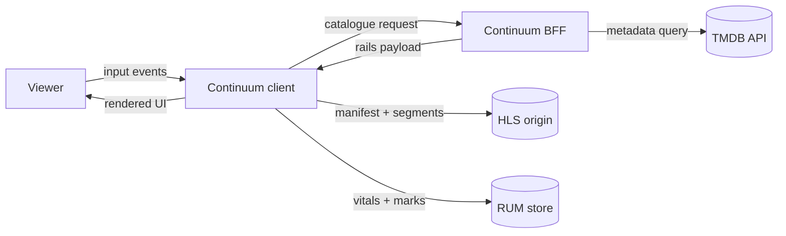

# Level 0 DFD — context

The client talks to exactly three things: the BFF for structure, the CDN for media, and the RUM endpoint for telemetry. Nothing else crosses the boundary.

See [docs/BRD-TRD.md §8](../BRD-TRD.md) for the full architecture writeup.
