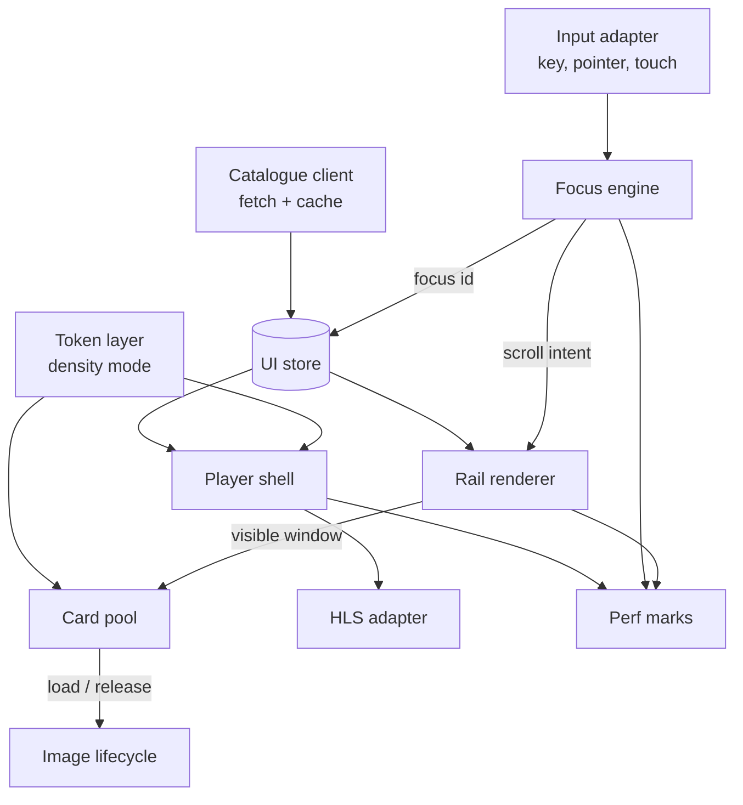

# Level 1 DFD — inside the client

Three independent inputs — user events, catalogue data, and density — converge on one store, from which the renderer derives a visible window. The focus engine and the rail renderer are coupled in exactly one place: focus movement produces a scroll intent, and scroll position feeds back as a new visible window. That loop is where every performance bug in this class of app lives.

See [docs/BRD-TRD.md §8](../BRD-TRD.md) for the full architecture writeup.
